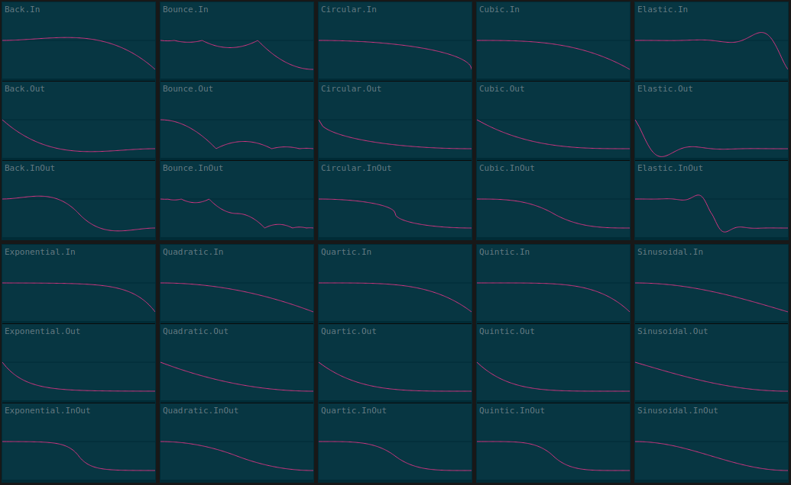

# OM.TWEEN

> Tween engine.

[](https://travis-ci.org/tong/om.tween)

## Usage

```haxe
var tween = new Tween( target )
    .to( { x:700, y:200, rotation:359 }, 2000 )
    .delay( 500 )
    .easing( Linear.None )
    .start();
```
See [examples/](examples/) for more complex usage.

## Ease Methods

